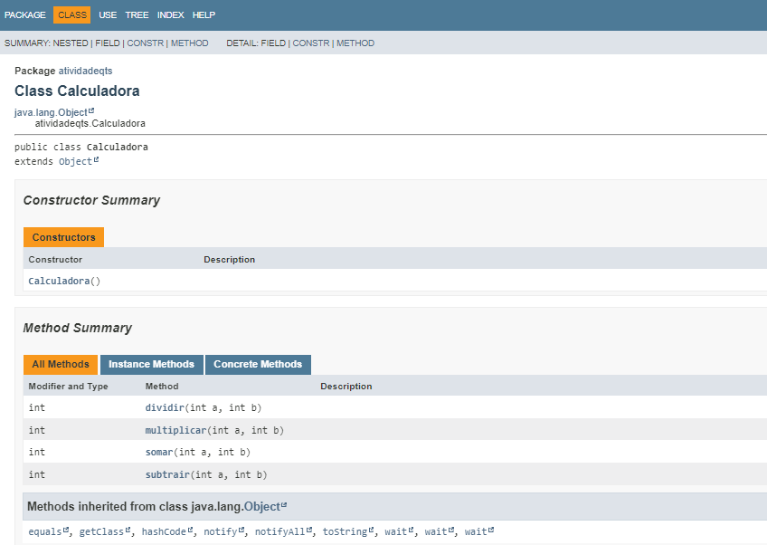
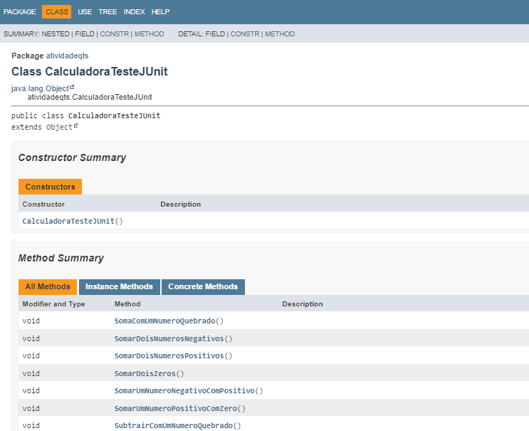
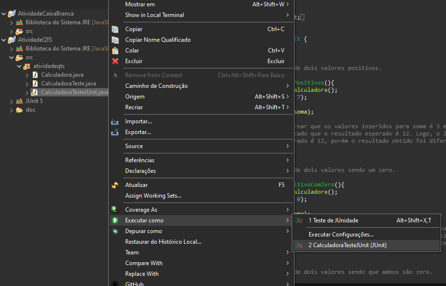
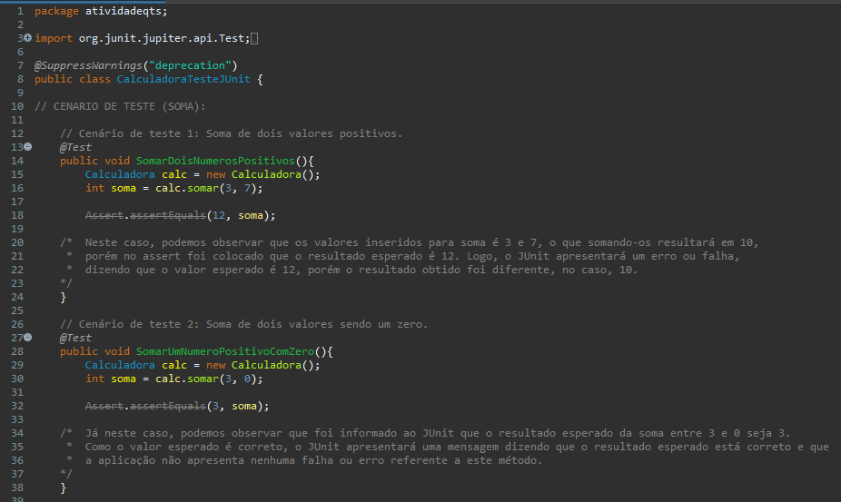

<h1 align="center"><strong>Documentação Teste de Calculadora</strong></h1>

## Descrição

Atividade de Qualidade e Testes de Software sobre Testes Automatizados, na qual deve-se desenvolver uma documentação para a calculadora e seus testes desenvolvidos anteriormente, utilizando a linguagem de programação Java e o framework JUnit 5.
Além disso, será mostrado o arquivo Javadoc tanto da classe calculadora, quanto da classe de testes JUnit.

## Javadoc

Foi feito um arquivo `javadoc` tanto da classe calculadora, quanto da classe de testes JUnit, veja a seguir uma breve imagem do conteúdo do javadoc, para mais detalhes, basta fazer o download do arquivo `.html` presente no repositório.

**Javadoc (Classe Calculadora):**

**Javadoc (Classe Testes JUnit):**

## Efetuando os Testes Automatizados

Utilizando o framework JUnit 5, criado especificamente para a execução de Testes em aplicações Java, é possível executar os testes da seguinte forma:

**1º:** Utilizando o software Eclipse, na aba de projetos, expanda a pasta até chegar nos respectivos arquivos .java da aplicação;

**2º:** Escolher a classe que deseja executar e clicar com o botão direito do mouse nela;

**3°:** Por fim, basta colocar o cursor em cima da opção `Run As` e logo em seguida clicar com o botão esquerdo do mouse em cima da opção `JUnit Test`, executando assim o teste da aplicação utilizando o JUnit.

Após seguir todos os passos, o JUnit abrirá um console próprio, onde exibirá todas as falhas ou erros, caso houver. Portanto, certifique-se de que a aplicação não apresentou nenhum erro e rodou com êxito.

## Utilizando a Calculadora

A calculadora possui a capacidade de efetuar as quatro operações matemáticas básicas, sendo elas:

- Soma
- Substração
- Multiplicação
- Divisão

## Última atualização: 10/11/2023
